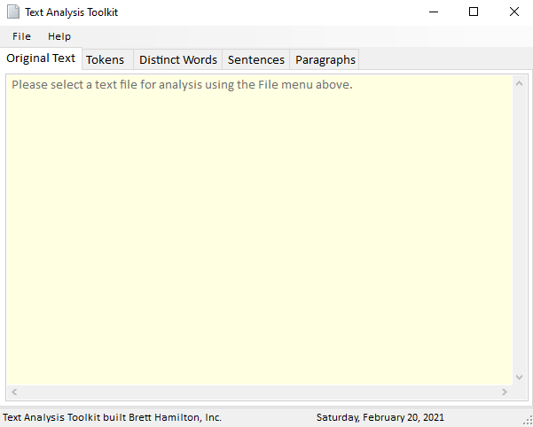

# TextAnalysisGUI
Text analysis toolkit for Data Structures course project

## About
The goal of this project is to provide a GUI for a program the I wrote to analyze a text file. The program allows the user to open an existing text file and break it down into components. It will break the text file into individual tokens (words and punctions), distinct words, individual sentences, and individual paragraphs. The program calculates statistics such as the number of times a word appears, the average word count for a sentence, the average sentence count for a paragraph, and more.
